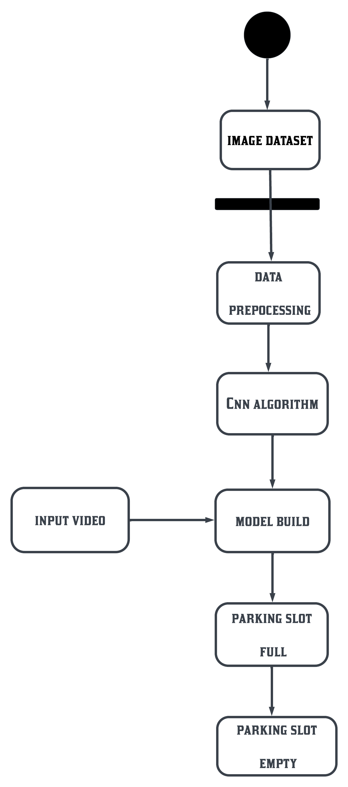
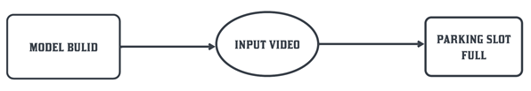
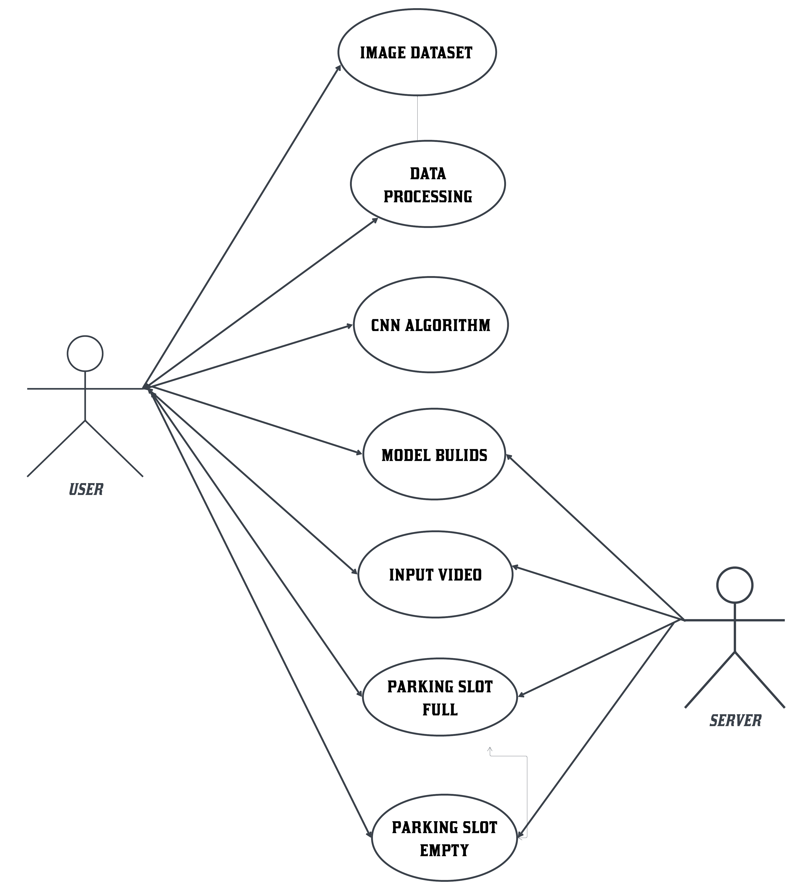

# STREETSPOT
Smart Street Parking Management System using CNN based Automated Slot Detection.

## Overview
STREETSPOT is a documentation based project that explains the architecture and workflow of an automated street parking slot detection system using Convolutional Neural Networks. The system processes input images or video frames and identifies parking slot occupancy.

## Features
- Automated street parking slot detection
- Data preprocessing workflow
- CNN based classification
- Real time decision flow
- System diagrams from the project report and PPT

## Project Workflow
1. Image dataset collection
2. Data preprocessing
3. CNN algorithm
4. Model build
5. Slot detection (full or empty)

## Activity Diagram

## Data Flow Diagram Level 0

## Data Flow Diagram Level 1

## Overall System Architecture Diagram

## Use Case Diagram

## Documentation
All detailed documentation from the project report is available inside the docs folder.

## Folder Structure
streetspot  
¦  
+-- README.md  
+-- diagrams  
¦   +-- diagram_0.png  
¦   +-- diagram_1.png  
¦   +-- diagram_2.png  
¦   +-- diagram_3.png  
¦   +-- diagram_4.png  
+-- docs  

## Technologies Used
- Python  
- OpenCV  
- CNN architecture principles  
- Image preprocessing  
- UML and DFD modeling  

## Future Enhancements
- Semantic segmentation for more precise boundaries
- Multi viewpoint detection
- Reinforcement learning for continuous model improvement  

